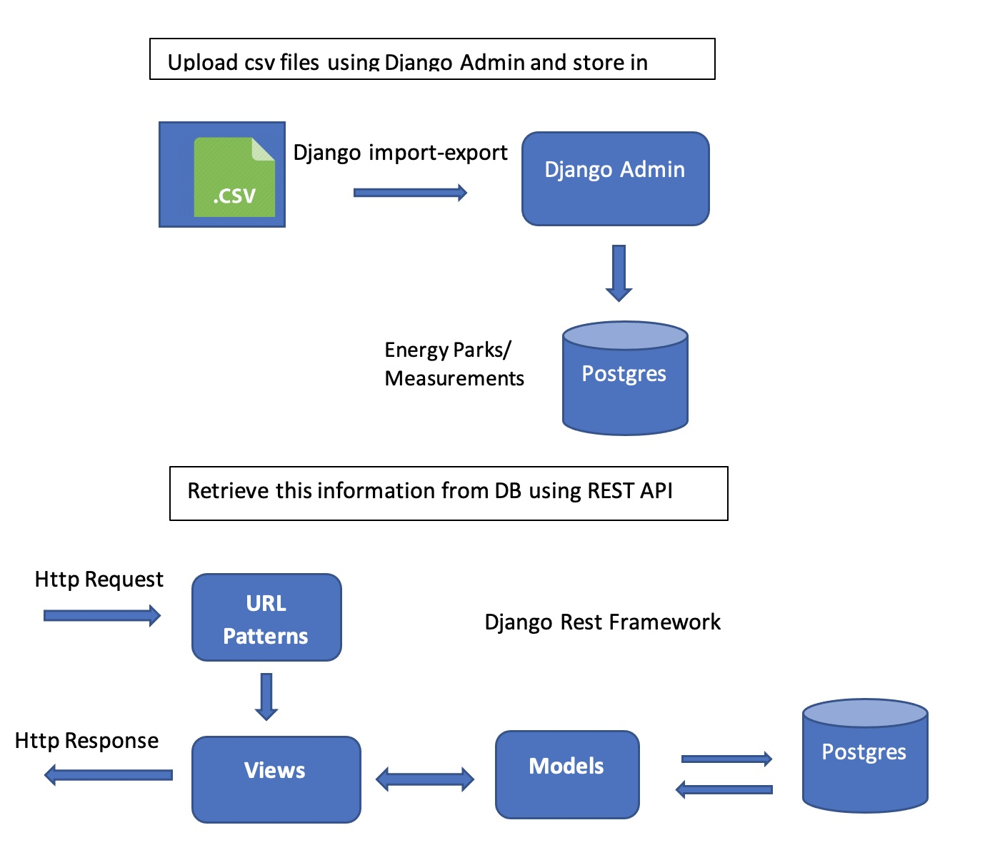
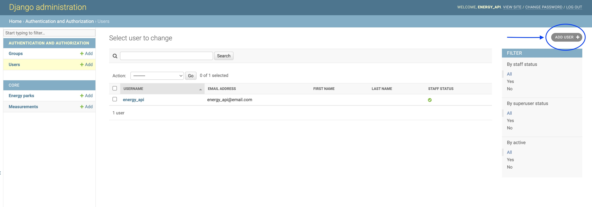
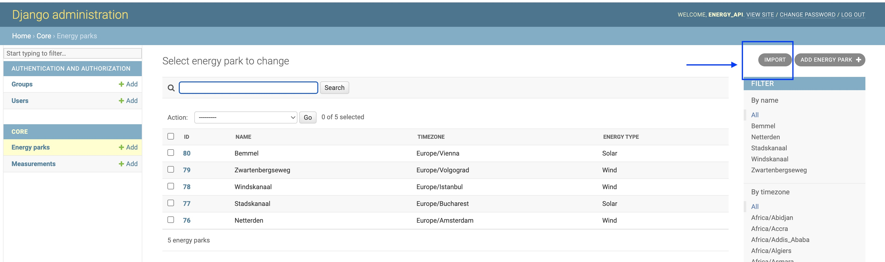
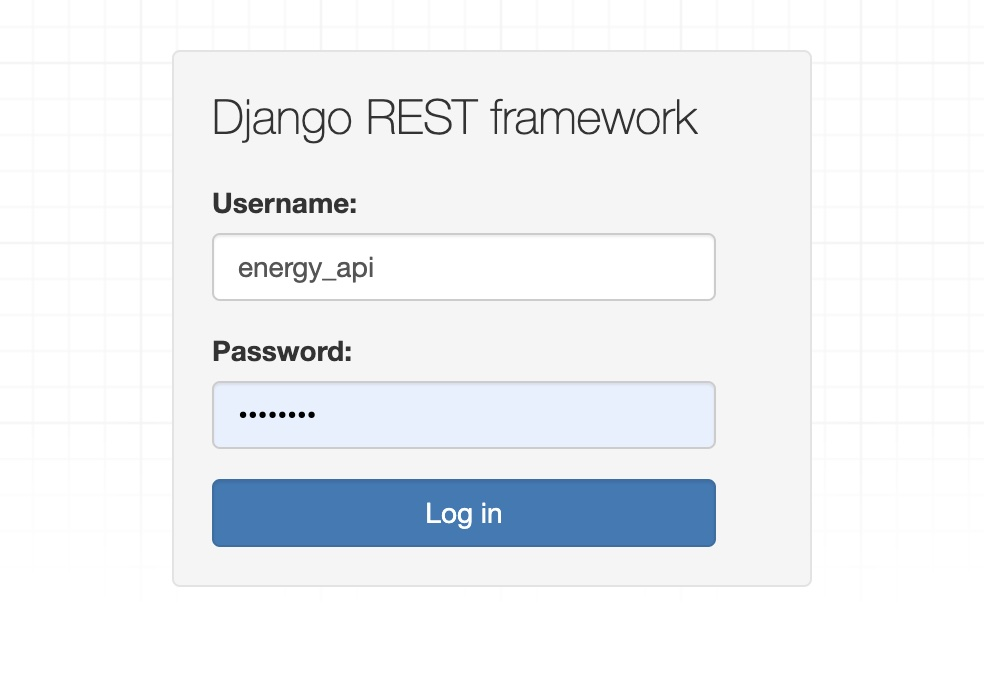
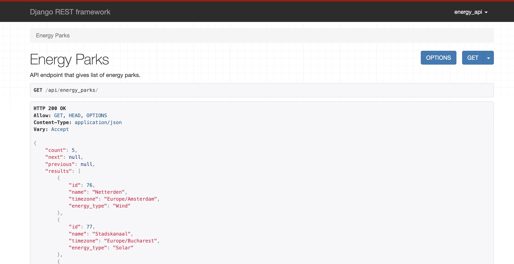
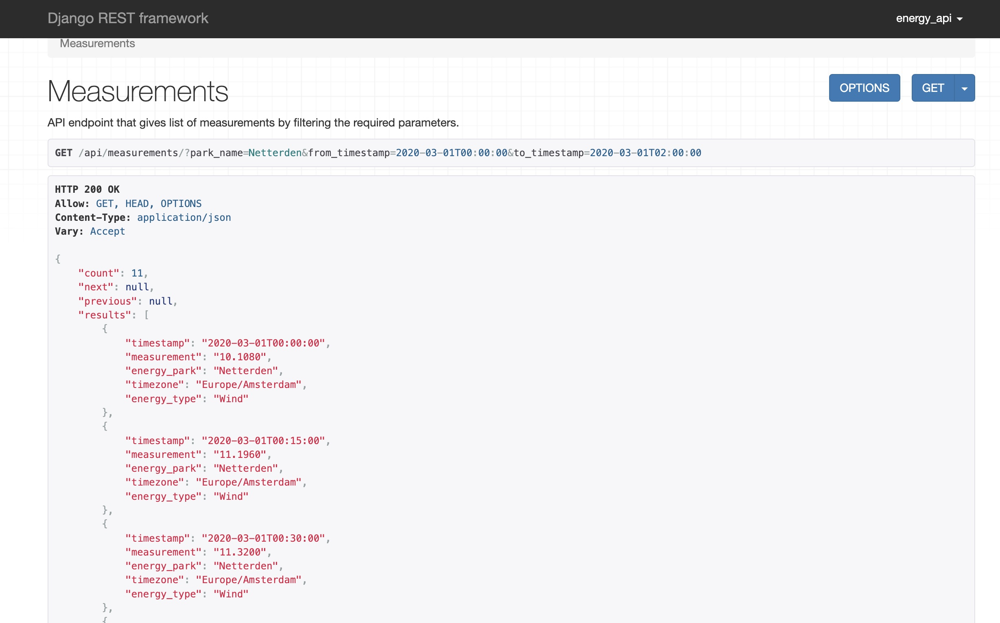

# Energy / Production API

# Setup 

## Virtual Environment (on Mac OS)

- Pre-requisites
```
PyEnv, PostgreSQL
```

- INSTALL  Pre-requisites

```
$ brew update

- PyEnv installation

$ brew install pyenv
$ echo -e 'if command -v pyenv 1>/dev/null 2>&1; then\n  eval "$(pyenv init --path)"\nfi' >> ~/.bash_profile

- PostgreSQL installation

$ brew install postgresql
$ brew services start postgresql (To start the Postgres DB)

```
- Create the PostgreSQL database which we are using for Application 
```
$ psql
$ CREATE DATABASE energy_api;
$ CREATE USER energy_api_user WITH PASSWORD energy_api_password;
$ ALTER ROLE energy_api_user SET client_encoding TO 'utf8';
$ GRANT ALL PRIVILEGES ON DATABASE energy_api TO energy_api_user;
```

- Install required Python version by using pyenv 
```
$ pyenv install 3.10.3
```
- check python version and creating python shell
```
$ pyenv versions
$ pyenv shell 3.10.3
```
- Go to project dir
```
$ cd ~/energy_api
```
- Create virtual environment
```
$ python -m venv .venv
```
- Install all needed packages
```
$ pip install -r requirements.txt
```
- Run Migrations
```
$ python manage.py makemigrations 
$ python manage.py migrate
```
- Start local server
```
$ python manage.py runserver
```
This should run the server and you may check the endpoints mentioned later in the guide 

Create a super user to look into the data in admin panel imported into DB via csv

- create superuser
```
$ python manage.py createsuperuser --email admin@example.com --username admin
                    
(Choose your own password)
```

The other option ( in case if you work with windows or any other OS ,
have docker installed in your system with below setup)

## Docker SetUp

- install docker -->  Ref: https://docs.docker.com/get-docker/
```
Install the docker and docker-cpmpose as per your OS
```

- Go to project folder and Run 
```
docker-compose up
```

- Running migrations
```
Running commands within Docker is a little different than in a traditional Django project. For example, to migrate the new PostgreSQL database running in Docker execute the following command:

$ docker-compose exec web python manage.py migrate
```

- Create superuser
```
If you wanted to run createsuperuser you'd also prefix it with docker-compose exec web. 

$ docker-compose exec web python manage.py createsuperuser
(Choose your own password)
```

- Down the docker container
```
Don't forget to close down your Docker container since it can consume a lot of computer memory.

$ docker-compose down
```

## Functional Design

 


## Django Admin

- For admin console use http://localhost:8000/admin/
```
Need to Login for all end points with the super user/ user credentials.
We can upload all csv related data or add the data via admin pannel.
```

- Create users via http://localhost:8000/admin/auth/user/

    
    
- Import energy parks information from csv file via import button in http://localhost:8000/admin/core/energypark/

    
    
- Import measurements/production information from csv file via import button in http://localhost:8000/admin/core/measurement/

    
    
- For both above imports need to select proper csv file and other info(If needed) and click on submit. After that you need confirm before saving the data.

## Django Rest Framework (DRF) / Rest API's

- Use DRF and login with your user credentials via http://localhost:8000/api-auth/login/

     

- Retrieve available energy parks  via http://localhost:8000/api/energy_parks/

    

- Retrieve Measurements information via  http://localhost:8000/api/measurements/

    

   - You can filter the measurements with different query parameters
   - Available Parameters
        - list of park_names (Comma separated park names) - Required parameter
        - from_timestamp 
        - to_timestamp 
        - energy_type (Wind/Solar) case sensitive
        
   - Example api with filters http://localhost:8000/api/measurements/?park_name=Netterden&from_timestamp=2020-03-01T00:00:00&to_timestamp=2020-03-01T02:00:00

### About Deployment, Security and Costs:
```
Not much familiar with AWS environment but my first step would be to containerize the application (make a docker image). 
and deploy this in Kubernetes cluster with separate DB services. 
For security purpose we need to maintain DNS server for https. 
Costs will be based on the Storage, Load, and Number of servers. 
```

### Authorisation:
```
Implement user relation with particular energy parks and their access.
So that we can give related data to related users with role based access.
```
### Authentication:
```
Presently it is using basic django rest framework 'api_auth' authentication.
We can implement json web token(JWT) validation for more security.
```
    
      


